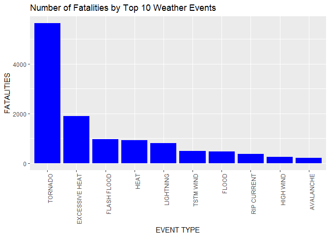
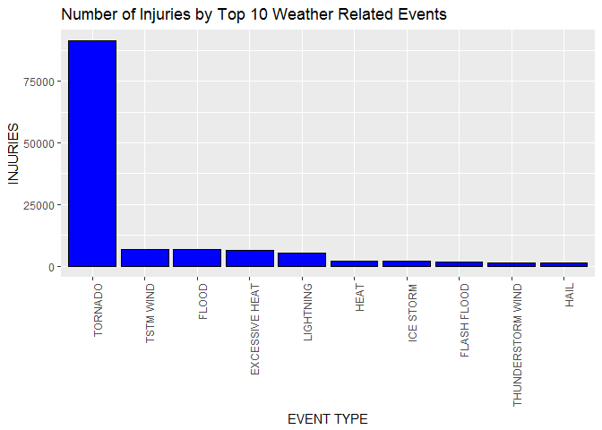
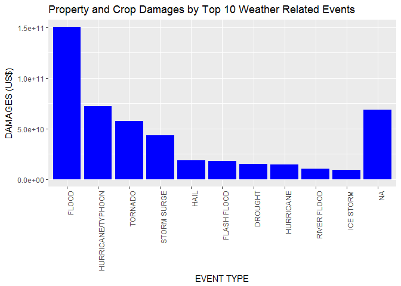

Reproducible Research: Peer Assessment 2
================
Pathik Chamaria
January 26, 2017

Tornados and Floods are the Two Most Harmful Weather Events Across the U.S
==========================================================================

Synopsis
--------

In this report, we aim to analyze the impact of different weather events on public health and economy based on the storm database collected from the U.S. National Oceanic and Atmospheric Administration???s (NOAA) from 1950 - 2011. We will use the estimates of fatalities, injuries, property and crop damage to decide which types of event are most harmful to the population health and economy. From these data, we found that excessive heat and tornado are most harmful with respect to population health, while flood, drought, and hurricane/typhoon have the greatest economic consequences.

Data Processing
---------------

``` r
library(readr)

if (!"StormData.csv.bz2" %in% dir("./")) {
     download.file("http://d396qusza40orc.cloudfront.net/repdata%2Fdata%2FStormData.csv.bz2", destfile = "StormData.csv.bz2")

 }
if(!file.exists("StormData.csv")){
    filePath <- "StormData.csv.bz2"
    destPath <- "StormData.csv"
    bunzip2(filePath,destPath,overwrite=TRUE, remove=FALSE)
  }
if(!exists("stormdata")){
  stormdata <- read.csv("StormData.csv")
}

dim(stormdata)
```

    ## [1] 902297     37

The column names of interest for this report are: FATALITIES, INJURIES, PROPDMG, PROPDMGEXP, CROPDMG, and CROPDMGEXP. To simplify the data worked with, create a subset of the stormdata data.

``` r
col.of.interest = c("EVTYPE", "FATALITIES", "INJURIES", "PROPDMG", "PROPDMGEXP", "CROPDMG",  "CROPDMGEXP")
data = stormdata[col.of.interest]
head(data)
```

    ##    EVTYPE FATALITIES INJURIES PROPDMG PROPDMGEXP CROPDMG CROPDMGEXP
    ## 1 TORNADO          0       15    25.0          K       0           
    ## 2 TORNADO          0        0     2.5          K       0           
    ## 3 TORNADO          0        2    25.0          K       0           
    ## 4 TORNADO          0        2     2.5          K       0           
    ## 5 TORNADO          0        2     2.5          K       0           
    ## 6 TORNADO          0        6     2.5          K       0

Because the PROPDMG and CROPDMG damage columns contain values without units of value, and the PROPDMGEXP and CROPDMGEXP do contain the unit value, it is required to convert the units to actual values to facilitate accurate calculations of economic consequences.

Below are the modifications and calculations for property damage.

``` r
unique(data$PROPDMGEXP)
```

    ##  [1] K M   B m + 0 5 6 ? 4 2 3 h 7 H - 1 8
    ## Levels:  - ? + 0 1 2 3 4 5 6 7 8 B h H K m M

``` r
# Assigning values for the property exponent data 
data$PROPEXP[data$PROPDMGEXP == "K"] = 1000
data$PROPEXP[data$PROPDMGEXP == "M"] = 1e+06
data$PROPEXP[data$PROPDMGEXP == ""] = 1
data$PROPEXP[data$PROPDMGEXP == "B"] = 1e+09
data$PROPEXP[data$PROPDMGEXP == "m"] = 1e+06
data$PROPEXP[data$PROPDMGEXP == "0"] = 1
data$PROPEXP[data$PROPDMGEXP == "5"] = 1e+05
data$PROPEXP[data$PROPDMGEXP == "6"] = 1e+06
data$PROPEXP[data$PROPDMGEXP == "4"] = 10000
data$PROPEXP[data$PROPDMGEXP == "2"] = 100
data$PROPEXP[data$PROPDMGEXP == "3"] = 1000
data$PROPEXP[data$PROPDMGEXP == "h"] = 100
data$PROPEXP[data$PROPDMGEXP == "7"] = 1e+07
data$PROPEXP[data$PROPDMGEXP == "H"] = 100
data$PROPEXP[data$PROPDMGEXP == "1"] = 10
data$PROPEXP[data$PROPDMGEXP == "8"] = 1e+08
# Assign '0' to invalid exponent data
data$PROPEXP[data$PROPDMGEXP == "+"] = 0
data$PROPEXP[data$PROPDMGEXP == "-"] = 0
data$PROPEXP[data$PROPDMGEXP == "?"] = 0
data$PROPEXP[is.na(data$PROPDMGEXP)] = 0
# Calculate the property damage value
data$PROPDMGVAL = data$PROPDMG * data$PROPEXP

head(data)
```

    ##    EVTYPE FATALITIES INJURIES PROPDMG PROPDMGEXP CROPDMG CROPDMGEXP
    ## 1 TORNADO          0       15    25.0          K       0           
    ## 2 TORNADO          0        0     2.5          K       0           
    ## 3 TORNADO          0        2    25.0          K       0           
    ## 4 TORNADO          0        2     2.5          K       0           
    ## 5 TORNADO          0        2     2.5          K       0           
    ## 6 TORNADO          0        6     2.5          K       0           
    ##   PROPEXP PROPDMGVAL
    ## 1    1000      25000
    ## 2    1000       2500
    ## 3    1000      25000
    ## 4    1000       2500
    ## 5    1000       2500
    ## 6    1000       2500

Below are the modifications and calculations for crop damage.

``` r
unique(data$CROPDMGEXP)
```

    ## [1]   M K m B ? 0 k 2
    ## Levels:  ? 0 2 B k K m M

``` r
data$CROPEXP[data$CROPDMGEXP == "M"] = 1e+06
data$CROPEXP[data$CROPDMGEXP == "K"] = 1000
data$CROPEXP[data$CROPDMGEXP == "m"] = 1e+06
data$CROPEXP[data$CROPDMGEXP == "B"] = 1e+09
data$CROPEXP[data$CROPDMGEXP == "0"] = 1
data$CROPEXP[data$CROPDMGEXP == "k"] = 1000
data$CROPEXP[data$CROPDMGEXP == "2"] = 100
data$CROPEXP[data$CROPDMGEXP == ""] = 1
# Assigning '0' to invalid exponent data
data$CROPEXP[data$CROPDMGEXP == "?"] = 0
data$CROPEXP[is.na(data$CROPDMGEXP)] = 0
# calculate the crop damage value
data$CROPDMGVAL = data$CROPDMG * data$CROPEXP
head(data)
```

    ##    EVTYPE FATALITIES INJURIES PROPDMG PROPDMGEXP CROPDMG CROPDMGEXP
    ## 1 TORNADO          0       15    25.0          K       0           
    ## 2 TORNADO          0        0     2.5          K       0           
    ## 3 TORNADO          0        2    25.0          K       0           
    ## 4 TORNADO          0        2     2.5          K       0           
    ## 5 TORNADO          0        2     2.5          K       0           
    ## 6 TORNADO          0        6     2.5          K       0           
    ##   PROPEXP PROPDMGVAL CROPEXP CROPDMGVAL
    ## 1    1000      25000       1          0
    ## 2    1000       2500       1          0
    ## 3    1000      25000       1          0
    ## 4    1000       2500       1          0
    ## 5    1000       2500       1          0
    ## 6    1000       2500       1          0

Results
-------

### Fatalities

``` r
# Store top 10 events with highest fatalities
fatalities = aggregate(FATALITIES ~ EVTYPE, data, sum)
fatalities = fatalities[order(-fatalities$FATALITIES), ][1:10, ]
fatalities$EVTYPE = factor(fatalities$EVTYPE, levels = fatalities$EVTYPE)

library(ggplot2)

ggplot(fatalities, aes(x = EVTYPE, y = FATALITIES)) + 
  geom_bar(stat = "identity", fill = "blue") +
  theme(axis.text.x = element_text(angle = 90, hjust = 1)) +
  xlab("EVENT TYPE") + ylab("FATALITIES") +
  ggtitle("Number of Fatalities by Top 10 Weather Events")
```



Injuries
--------

``` r
# Store the top 10 events with highest injuries
injuries = aggregate(INJURIES ~ EVTYPE, data, sum)
injuries = injuries[order(-injuries$INJURIES), ][1:10, ]
injuries$EVTYPE = factor(injuries$EVTYPE, levels = injuries$EVTYPE)

ggplot(injuries, aes(x = EVTYPE, y = INJURIES)) + 
  geom_bar(stat = "identity", fill = "blue", col= "black") + 
  theme(axis.text.x = element_text(angle = 90, hjust = 1)) + 
  xlab("EVENT TYPE") + ylab("INJURIES") + 
  ggtitle("Number of Injuries by Top 10 Weather Related Events")
```



Economic consequences
---------------------

``` r
ecoDamage = aggregate(data$PROPDMGVAL + data$CROPDMGVAL ~ EVTYPE, data, sum)
names(ecoDamage) = c("EVTYPE", "TDAMAGE")
ecoDamege = ecoDamage[order(-ecoDamage$TDAMAGE), ][1:10, ]
ecoDamage$EVTYPE = factor(ecoDamage$EVTYPE, levels = ecoDamege$EVTYPE)

ggplot(ecoDamage, aes(x = EVTYPE, y = TDAMAGE)) + 
    geom_bar(stat = "identity", fill = "blue") + 
    theme(axis.text.x = element_text(angle = 90, hjust = 1)) + 
    xlab("EVENT TYPE") + ylab("DAMAGES (US$)") +
  ggtitle("Property and Crop Damages by Top 10 Weather Related Events")
```



We can see that Flood is the major cause of property damages and have the greatest economic consequences.

Conclusion
==========

From these data, we found that Tornado are most harmful with respect to population health, while Flood have the greatest economic consequences.
